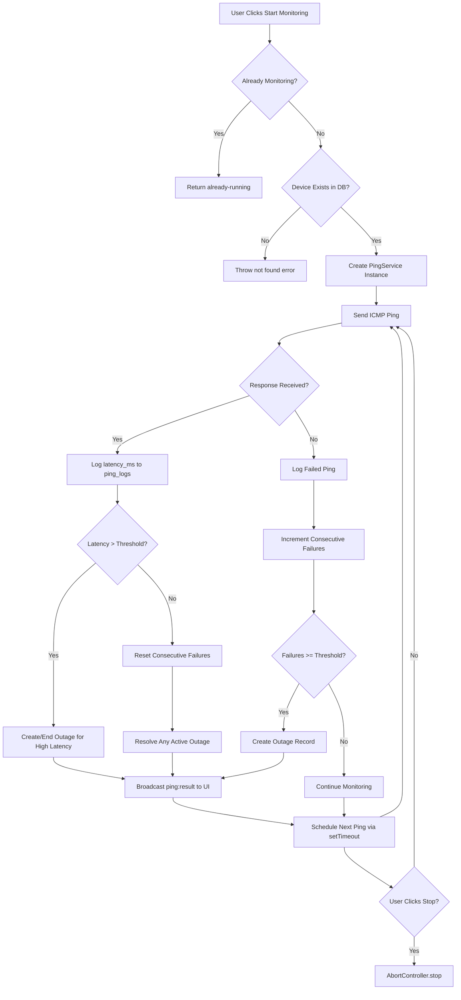
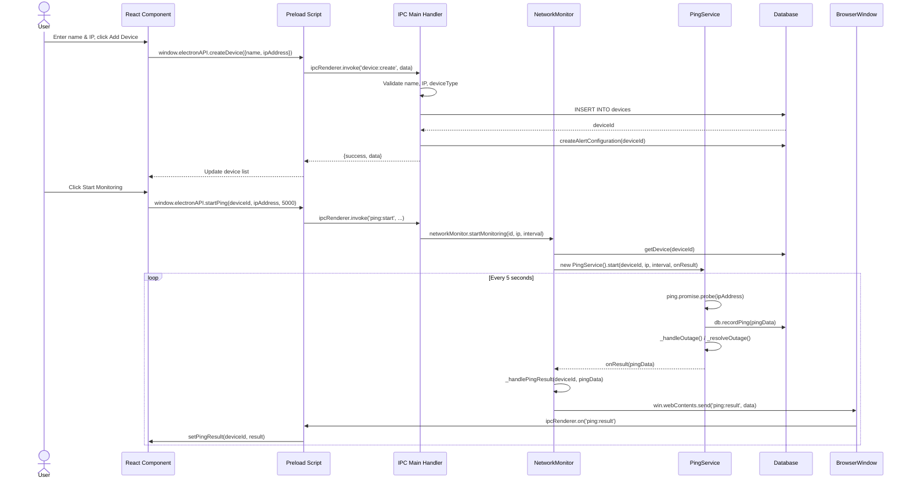
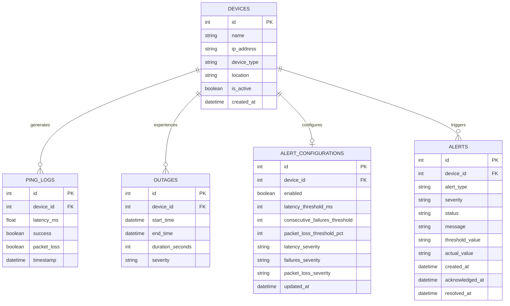

# AMF Network Device Monitor — Key Diagrams

## 1. Flowchart: Device Monitoring Lifecycle

---

## 2. Sequence Diagram: Add Device and Start Monitoring

---

## 3. Entity Relationship Diagram: Database Schema

