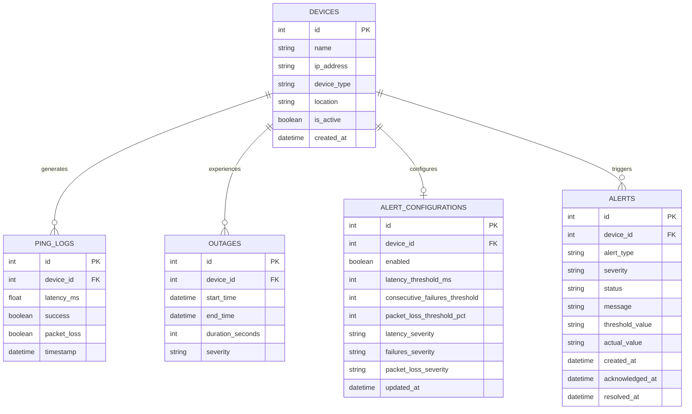
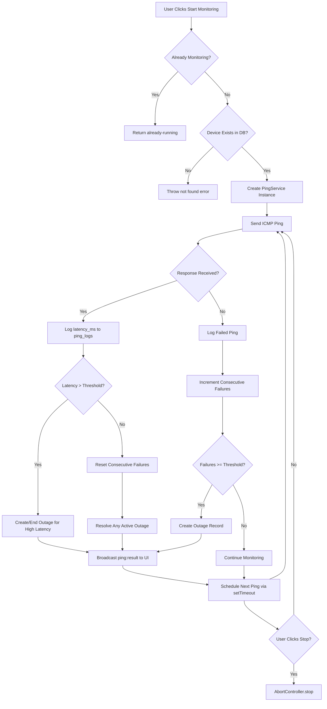
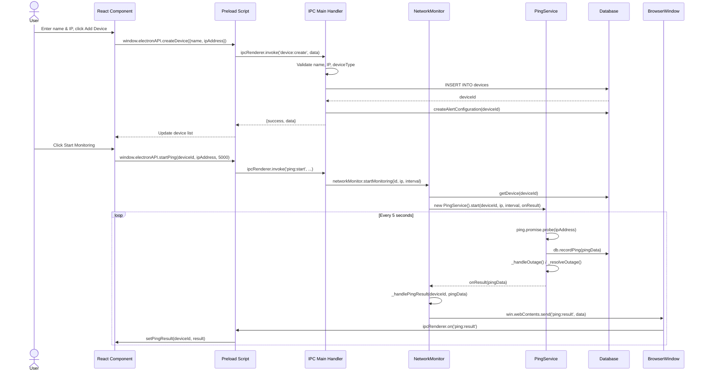

# AMF Network Device Monitor - Technical Deep Dive & Best Practices

**Companion Document to:** `AMF-Network-Monitor-Agile-Strategy.md`  
**Purpose:** Detailed technical analysis, comparisons, and elite-level recommendations  
**Audience:** Developer, Line Manager, EPA Assessor

---

## Table of Contents
1. [Frameworks Comparison](#1-frameworks-comparison)
2. [Libraries Deep Dive](#2-libraries-deep-dive)
3. [Security Architecture](#3-security-architecture)
4. [Memory Management Patterns](#4-memory-management-patterns)
5. [Testing Strategy & Coverage](#5-testing-strategy--coverage)
6. [Git Management & Workflow](#6-git-management--workflow)
7. [User Stories & Personas](#7-user-stories--personas)
8. [Elite Project Enhancements](#8-elite-project-enhancements)
9. [Comparison with Strategy Document](#9-comparison-with-strategy-document)

---

## 1. Frameworks Comparison

### 1.1 Desktop Framework Analysis

| Framework | Pros | Cons | Verdict |
|-----------|------|------|---------|
| **Electron** | Mature ecosystem, Node.js native, extensive docs, proven in production (Slack, VS Code), cross-platform | Large bundle size (~150MB), memory overhead, security requires discipline | **SELECTED** - Best fit for KSB evidence and rapid development |
| **Tauri** | Tiny bundle (~5MB), Rust backend, modern security model | Steep Rust learning curve, smaller community, limited npm ecosystem | Good for production but risky for apprenticeship timeline |
| **WPF (C#)** | Native Windows performance, excellent tooling | Windows-only, requires C# knowledge, not cross-platform | Eliminated - KSBs require modern web tech |
| **Flutter Desktop** | Single codebase (mobile+desktop), fast UI | Dart learning curve, limited desktop maturity | Eliminated - Less evidence for web dev KSBs |

**Decision Rationale:** Electron aligns with existing Temperature Plotter knowledge, provides clear KSB evidence for S1, S10, K7, and allows focus on deliverables over framework learning.

### 1.2 UI Framework Comparison

| Framework | Pros | Cons | Best For |
|-----------|------|------|----------|
| **React 18** | Largest ecosystem, Concurrent Features, excellent debugging, extensive jobs market | Requires state management addition, can over-engineer | **General purpose - SELECTED** |
| **Vue 3** | Gentle learning curve, Composition API, smaller bundle | Smaller job market, fewer enterprise patterns | Rapid prototyping |
| **Svelte** | No virtual DOM, smallest bundle, reactive by default | Smaller ecosystem, tooling less mature | Performance-critical apps |
| **SolidJS** | Fastest rendering, fine-grained reactivity | Very new, tiny community, risky for projects | Experimental projects |

**Recommendation:** React 18 with TypeScript - provides strongest KSB evidence (S2, K4) and transferable skills.

### 1.3 Build Tool Comparison

| Tool | Cold Start | HMR | Native Modules | Verdict |
|------|------------|-----|----------------|---------|
| **Vite** | ~300ms | Near instant | Excellent | **SELECTED** - Fastest DX |
| Webpack | ~3s | ~1s | Good | Mature but slow |
| esbuild | ~100ms | Fast | Limited | Tooling immature |
| Parcel | ~2s | ~500ms | Good | Zero-config but slower |

---

## 2. Libraries Deep Dive

### 2.1 Database Libraries

**Selected: better-sqlite3**

| Library | Pros | Cons | Use Case |
|---------|------|------|----------|
| **better-sqlite3** | Synchronous (simpler code), prepared statements, fastest SQLite, no callback hell | Native compilation required, single-threaded | **Desktop apps - SELECTED** |
| sqlite3 (node) | Async, no compilation | Callback-heavy, slower | Server applications |
| node-sqlite3-wasm | No native deps, portable | 2-3x slower, WASM overhead | Distribution constraints |
| Lowdb | Zero config, JSON-based | No queries, poor performance | Tiny apps (<1000 records) |
| Realm | Object-oriented, reactive | Commercial license, heavy | Mobile-first apps |

**Better-sqlite3 Best Practices (Recommended Pattern):**

The actual implementation uses a singleton `DatabaseManager` class with lazy-loaded `better-sqlite3`, prepared statement caching via `getStatement()`, and WAL mode. See `@src/main/db/database.js` for the full implementation.

```javascript
// Recommended pattern: Singleton with prepared statement caching
class DatabaseManager {
  static instance = null;
  statements = new Map();
  
  static getInstance() {
    if (!DatabaseManager.instance) {
      DatabaseManager.instance = new DatabaseManager();
    }
    return DatabaseManager.instance;
  }
  
  // Actual method from the codebase
  getStatement(name, sql) {
    if (!this.statements.has(name)) {
      this.statements.set(name, this.db.prepare(sql));
    }
    return this.statements.get(name);
  }
}
```

**Database Schema (Entity Relationship Diagram):**



### 2.2 Network/Ping Libraries

**Selected: ping (npm)**

| Library | Pros | Cons | Verdict |
|---------|------|------|---------|
| **ping** | Cross-platform, Promise-based, simple API | Requires child_process | **SELECTED** - Cleanest API |
| node-net-ping | Raw sockets (faster), no external binary | Requires admin on Windows, complex | Performance-critical |
| net-ping-fix | Bug fixes on node-net-ping | Smaller community | Fork consideration |
| child_process direct | No dependency | Manual parsing per OS | Too low-level |

**Actual PingService Implementation:**

`@c:\Users\Greg\Desktop\Projects\network-device-monitor\src\main\services\ping-service.js`

```javascript
class PingService {
  constructor() {
    this.abortController = null
    this.isRunning = false
    this.deviceId = null
    this.ipAddress = null
    this.intervalMs = 5000
    
    // Outage detection thresholds
    this.outageThresholds = {
      consecutiveFailures: 3,
      maxLatencyMs: 1000,
      criticalLatencyMs: 5000
    }
    
    // Outage state tracking
    this.outageState = {
      consecutiveFailures: 0,
      lastSuccessfulPing: null,
      activeOutageSeverity: null
    }
  }
  
  async start(deviceId, ipAddress, intervalMs = 5000, onResult = null) {
    if (this.isRunning) {
      throw new Error('PingService already running. Stop it first.')
    }
    
    this.deviceId = deviceId
    this.ipAddress = ipAddress
    this.intervalMs = intervalMs
    this.isRunning = true
    this.abortController = new AbortController()
    
    // Immediate first ping
    await this._pingOnce(onResult)
    
    // Schedule subsequent pings via recursive setTimeout
    this._schedulePings(onResult)
  }
  
  stop() {
    if (!this.isRunning) return
    this.isRunning = false
    
    if (this.abortController) {
      this.abortController.abort()
      this.abortController = null
    }
  }
  
  async _pingOnce(onResult) {
    try {
      if (this.abortController?.signal.aborted) return
      
      const isWindows = os.platform() === 'win32'
      const result = await ping.promise.probe(this.ipAddress, {
        timeout: 3,
        extra: isWindows ? ['-n', '1', '-w', '3000'] : ['-c', '1']
      })
      
      // Record to database
      const db = await getDatabase()
      db.recordPing(pingData)
      
      // Handle outage conditions
      if (!result.alive) {
        this.outageState.consecutiveFailures++
        await this._handleOutage()
      } else {
        this.outageState.consecutiveFailures = 0
        await this._resolveOutage()
      }
      
      if (onResult) onResult(pingData)
      
    } catch (error) {
      const db = await getDatabase()
      db.recordPing(failedPingData)
      this.outageState.consecutiveFailures++
      await this._handleOutage()
      if (onResult) onResult(failedPingData)
    }
  }
  
  _schedulePings(onResult) {
    const scheduleNext = async () => {
      if (!this.isRunning || this.abortController?.signal.aborted) return
      await this._pingOnce(onResult)
      if (this.isRunning) {
        setTimeout(scheduleNext, this.intervalMs)
      }
    }
    setTimeout(scheduleNext, this.intervalMs)
  }
}
```

**Device Monitoring Lifecycle (Flowchart):**



### 2.3 Charting Libraries

**Selected: Recharts**

| Library | Pros | Cons | Best For |
|---------|------|------|----------|
| **Recharts** | React-native, composable, good docs | Performance drops at >1000 points | **General use - SELECTED** |
| Chart.js | Canvas-based, fast, mature | Imperative API, React wrapper needed | Performance-critical |
| D3.js | Infinite flexibility | Steep learning curve, verbose | Custom visualisations |
| Victory | Cross-platform (React Native) | Smaller ecosystem | Mobile+Web apps |
| Tremor | Pre-built dashboard components | Less customisation | Rapid dashboards |

**Performance Optimisation for Recharts (Recommended Pattern):**

These patterns are not currently implemented in the codebase but are recommended for future optimisation when handling large datasets.

```javascript
// Recommended pattern: Data decimation for large datasets
const useDecimatedData = (data, maxPoints = 100) => {
  return useMemo(() => {
    if (data.length <= maxPoints) return data;
    
    const step = Math.ceil(data.length / maxPoints);
    return data.filter((_, index) => index % step === 0);
  }, [data, maxPoints]);
};

// Recommended pattern: Custom tooltip for performance
const CustomTooltip = memo(({ active, payload }) => {
  if (!active || !payload?.length) return null;
  
  return (
    <div className="tooltip">
      {payload.map(entry => (
        <span key={entry.dataKey}>{entry.value}ms</span>
      ))}
    </div>
  );
});
```

### 2.4 State Management

**Selected: Zustand**

| Library | Boilerplate | Learning Curve | Bundle | Verdict |
|---------|-------------|------------------|--------|---------|
| **Zustand** | Minimal | Low | 1KB | **SELECTED** - Perfect balance |
| Redux Toolkit | Medium | Medium | 11KB | Complex apps |
| Jotai | Minimal | Low | 2KB | Atom-based preference |
| Valtio | Minimal | Low | 2KB | Proxy-based |
| Context API | None | Low | 0KB | Prop drilling only |

**Zustand Pattern:**

The actual implementation uses a monolithic store in `@src/renderer/stores/deviceStore.js`. The slice pattern below is a recommended refactor for future scalability.

```javascript
// Actual implementation (monolithic store)
export const useDeviceStore = create(
  devtools(
    (set, get) => ({
      // Device list state
      devices: [],
      isLoading: false,
      error: null,
      
      // Ping monitoring state
      pingResults: {},
      isMonitoring: {},
      pingHistory: {},
      
      // Actions
      setDevices: (devices) => set({ devices, isLoading: false, error: null }),
      addDevice: (device) => set(
        (state) => ({ devices: [...state.devices, device] }),
        false,
        'addDevice'
      ),
      // ... additional state and actions
    }),
    { name: 'DeviceStore' }
  )
)

// Recommended pattern for future: Slice pattern for scalability
const createDeviceSlice = (set, get) => ({
  devices: [],
  addDevice: (device) => set(
    state => ({ devices: [...state.devices, device] }),
    false,
    'device/add'
  )
});
```

---

## 3. Security Architecture

### 3.1 Electron Security Checklist

```markdown
## Pre-Development Security Checklist

### Main Process
- [ ] ContextIsolation: true (non-negotiable)
- [ ] nodeIntegration: false (non-negotiable)
- [ ] sandbox: true for all renderers
- [ ] allowRunningInsecureContent: false
- [ ] experimentalFeatures: false
- [ ] navigateOnDragDrop: false

### IPC Communication
- [ ] Whitelist all IPC channels
- [ ] Validate all inputs on main side
- [ ] Never trust renderer data
- [ ] Use structured clone (not JSON stringify)

### Content Security Policy
- [ ] script-src 'self' (no inline scripts)
- [ ] style-src 'self' 'unsafe-inline' (if CSS-in-JS)
- [ ] connect-src 'self' (no external APIs)
- [ ] default-src 'self'
```

### 3.2 Input Validation Matrix

| Input | Validation | Sanitisation | SQL Injection Prevention |
|-------|------------|--------------|--------------------------|
| IP Address | IPv4/IPv6 regex | Whitelist chars only | Parameterised query |
| Device Name | Length (1-100), alphanumeric | HTML escape | Parameterised query |
| Device Type | Enum whitelist | String cast | Parameterised query |
| Latency | Numeric range (0-30000ms) | Float cast | Parameterised query |

**Validation Implementation:**

`@c:\Users\Greg\Desktop\Projects\network-device-monitor\src\main\ipc\handlers.js:141`

```javascript
// Actual validators — return booleans, not objects
const validators = {
  ipAddress: (value) => {
    const ipv4 = /^(?:(?:25[0-5]|2[0-4][0-9]|[01]?[0-9][0-9]?)\.){3}(?:25[0-5]|2[0-4][0-9]|[01]?[0-9][0-9]?)$/
    const ipv6 = /^(?:[0-9a-fA-F]{1,4}:){7}[0-9a-fA-F]{1,4}$/
    return ipv4.test(value) || ipv6.test(value)
  },

  hostname: (value) => {
    if (!value || value.length > 253 || value.length < 1) return false
    const labels = value.split('.')
    const labelRegex = /^[a-zA-Z0-9]([a-zA-Z0-9-]{0,61}[a-zA-Z0-9])?$/
    for (const label of labels) {
      if (!labelRegex.test(label)) return false
    }
    return true
  },

  networkAddress: async (value) => {
    if (validators.ipAddress(value)) return true
    if (validators.hostname(value)) {
      // Verify hostname is resolvable
      try {
        await new Promise((resolve, reject) => {
          dns.lookup(value, (err, address) => {
            if (err) reject(err)
            else resolve(address)
          })
        })
        return true
      } catch (error) {
        return false
      }
    }
    return false
  },

  deviceName: (value) => {
    return value && value.length >= 1 && value.length <= 100
  },

  deviceType: (value) => {
    return ['server', 'router', 'printer', 'switch'].includes(value)
  }
}

// Handlers use wrapHandler() for consistent error formatting
function wrapHandler(name, handler) {
  return async (event, ...args) => {
    try {
      return await handler(event, ...args)
    } catch (error) {
      console.error(`Error ${name}:`, error)
      return { success: false, error: error.message }
    }
  }
}
```

### 3.3 Secure IPC Pattern

`@c:\Users\Greg\Desktop\Projects\network-device-monitor\src\preload\index.js`

```javascript
// Security: Whitelist of valid IPC channels
const VALID_CHANNELS = [
  // Device management
  'device:create',
  'device:read',
  'device:update',
  'device:delete',
  'device:getWithStatus',
  'device:getStatusSummary',
  // Ping operations
  'ping:start',
  'ping:stop',
  'ping:startAll',
  'ping:stopAll',
  'ping:status',
  'ping:result',
  'ping:record',
  'ping:getRecent',
  'ping:getStats',
  // Outage operations
  'outage:getActive',
  'outage:getHistory',
  'outage:configureThresholds',
  // Historical aggregation (Sprint 4)
  'history:uptime',
  'history:latency',
  'history:outages',
  'history:summary',
  'history:allSummaries',
  // Database
  'db:stats',
  // Export
  'export:csv',
  'export:html',
  'export:saveFile',
  // Retention
  'retention:getStats',
  'retention:applyPolicy',
  // Alert configuration
  'alertConfig:get',
  'alertConfig:getAll',
  'alertConfig:create',
  'alertConfig:update',
  'alertConfig:delete',
  // Alert events
  'alert:create',
  'alert:get',
  'alert:getByDevice',
  'alert:getActive',
  'alert:acknowledge',
  'alert:resolve',
  'alert:resolveDevice'
]

// Expose named API methods (not generic invoke/on wrapper)
contextBridge.exposeInMainWorld('electronAPI', {
  // Device management
  createDevice: (deviceData) => ipcRenderer.invoke('device:create', deviceData),
  getDevices: (id) => ipcRenderer.invoke('device:read', id),
  updateDevice: (id, updates) => ipcRenderer.invoke('device:update', id, updates),
  deleteDevice: (id) => ipcRenderer.invoke('device:delete', id),
  
  // Ping monitoring
  startPing: (deviceId, ipAddress, intervalMs) => 
    ipcRenderer.invoke('ping:start', deviceId, ipAddress, intervalMs),
  stopPing: (deviceId) => ipcRenderer.invoke('ping:stop', deviceId),
  
  // Event listeners with cleanup
  onPingResult: (callback) => {
    const wrappedCallback = (event, ...args) => callback(...args)
    ipcRenderer.on('ping:result', wrappedCallback)
    return () => {
      ipcRenderer.removeListener('ping:result', wrappedCallback)
    }
  }
})
```

**Add Device and Start Monitoring (Sequence Diagram):**



---

## 4. Memory Management Patterns

### 4.1 Electron Process Architecture

```
┌─────────────────────────────────────────┐
│           Main Process                  │
│  ┌─────────┐  ┌─────────┐  ┌──────────┐ │
│  │ Database│  │ Network │  │  IPC     │ │
│  │ Manager │  │ Monitor │  │ Handlers │ │
│  └─────────┘  └─────────┘  └──────────┘ │
└──────────────┬──────────────────────────┘
               │ IPC (structured clone)
┌──────────────▼──────────────────────────┐
│         Renderer Process                │
│  ┌─────────┐  ┌─────────┐  ┌──────────┐ │
│  │  React  │  │ Zustand │  │ Recharts │ │
│  │   UI    │  │  Store  │  │          │ │
│  └─────────┘  └─────────┘  └──────────┘ │
└─────────────────────────────────────────┘
```

### 4.2 Memory Leak Prevention

**Common Leaks & Solutions:**

| Pattern | Leak Risk | Solution |
|---------|-----------|----------|
| setInterval without cleanup | High | useEffect cleanup + AbortController |
| Event listeners in renderer | High | removeListener in useEffect cleanup |
| Large datasets in state | Medium | Virtualisation + data decimation |
| Database connections | High | Singleton pattern + explicit close |
| DOM references in refs | Low | React ref cleanup |

**Recommended Pattern: Resource Manager (Not Currently Implemented)**

The actual codebase cleans up resources manually in `useEffect` return functions. The pattern below is a recommended abstraction for future use.

```javascript
// Recommended pattern: Centralised cleanup
class ResourceManager {
  resources = new Map();
  
  register(id, cleanupFn) {
    if (this.resources.has(id)) {
      this.dispose(id);
    }
    this.resources.set(id, cleanupFn);
  }
  
  dispose(id) {
    const cleanup = this.resources.get(id);
    if (cleanup) {
      try {
        cleanup();
      } catch (error) {
        console.error(`Cleanup error for ${id}:`, error);
      }
      this.resources.delete(id);
    }
  }
  
  disposeAll() {
    this.resources.forEach((cleanup, id) => this.dispose(id));
  }
}

// Actual pattern in codebase: manual cleanup in useEffect
useEffect(() => {
  const cleanup = window.electronAPI?.onPingResult((result) => {
    useDeviceStore.getState().setPingResult(result.deviceId, result)
  })
  return () => { if (cleanup) cleanup() }
}, [])
```

### 4.3 Database Connection Lifecycle

`@c:\Users\Greg\Desktop\Projects\network-device-monitor\src\main\db\database.js`

```javascript
// Lazy-loaded better-sqlite3 (native module, must not be bundled)
let Database = null
async function getDatabaseClass() {
  if (!Database) {
    const module = await import('better-sqlite3')
    Database = module.default
  }
  return Database
}

class DatabaseManager {
  static instance = null
  db = null
  statements = new Map()
  
  static getInstance() {
    if (!DatabaseManager.instance) {
      DatabaseManager.instance = new DatabaseManager()
    }
    return DatabaseManager.instance
  }
  
  async initialise() {
    if (this.db) return
    
    const DatabaseClass = await getDatabaseClass()
    const dbPath = path.join(app.getPath('userData'), 'network-monitor.sqlite')
    
    // Ensure directory exists
    const dbDir = path.dirname(dbPath)
    if (!fs.existsSync(dbDir)) {
      fs.mkdirSync(dbDir, { recursive: true })
    }
    
    // Create single persistent connection
    this.db = new DatabaseClass(dbPath)
    
    this.db.pragma('journal_mode = WAL')
    this.db.pragma('foreign_keys = ON')
    
    this.initialiseSchema()
    this.runMigrations()
  }
  
  // Prepared statement caching for performance
  getStatement(name, sql) {
    if (!this.statements.has(name)) {
      this.statements.set(name, this.db.prepare(sql))
    }
    return this.statements.get(name)
  }
}

// Singleton export used across all services
export async function getDatabase() {
  const manager = DatabaseManager.getInstance()
  await manager.initialise()
  return manager
}
```

---

## 5. Testing Strategy & Coverage

### 5.1 Testing Pyramid for Electron Apps

```
                 /\
                /  \     E2E (5%)
               /____\    Playwright/Spectron
              /      \   Critical paths only
             /________\
            /          \   Integration (15%)
           /____________\  Database + IPC
          /              \  Component + hook tests
         /________________\
        /                  \  Unit (80%)
       /____________________\ Logic, utilities
                              Jest + React Testing Library
```

### 5.2 Coverage Requirements by Layer

| Layer | Target Coverage | Critical Areas |
|-------|-----------------|----------------|
| Utilities/Helpers | 95% | IP validation, data transformation |
| Database Layer | 90% | All CRUD, queries, migrations |
| IPC Handlers | 85% | Input validation, error handling |
| React Components | 80% | User interactions, state changes |
| Integration | 70% | Full user flows |

### 5.3 Test Patterns

**Database Testing with In-Memory SQLite:**

`@c:\Users\Greg\Desktop\Projects\network-device-monitor\tests\unit\database.test.js`

```javascript
// Actual test file: uses dynamic import for better-sqlite3
import { getDatabase } from '../../src/main/db/database.js'

describe('Database Layer', () => {
  let db
  
  beforeAll(async () => {
    // Mock app.getPath to avoid filesystem dependency
    jest.mock('electron', () => ({
      app: { getPath: () => ':memory:' }
    }))
    db = await getDatabase()
  })
  
  afterEach(() => {
    // Clean up between tests
    db.db.exec('DELETE FROM ping_logs')
    db.db.exec('DELETE FROM outages')
    db.db.exec('DELETE FROM devices')
  })
  
  it('should create device with valid data', () => {
    const result = db.createDevice({
      name: 'Test Router',
      ipAddress: '192.168.1.1',
      deviceType: 'router',
      isActive: true
    })
    
    expect(result.id).toBeDefined()
    expect(result.name).toBe('Test Router')
  })
  
  it('should enforce partial unique index on active devices', () => {
    db.createDevice({ name: 'Device 1', ipAddress: '192.168.1.1', deviceType: 'server', isActive: true })
    
    // Should throw for duplicate IP on active device
    expect(() => {
      db.createDevice({ name: 'Device 2', ipAddress: '192.168.1.1', deviceType: 'server', isActive: true })
    }).toThrow(/UNIQUE constraint failed/)
  })
  
  it('should cascade delete ping logs', () => {
    const device = db.createDevice({ name: 'Test', ipAddress: '192.168.1.2', deviceType: 'server', isActive: true })
    db.recordPing({ deviceId: device.id, latencyMs: 10, success: true, packetLoss: false })
    
    db.deleteDevice(device.id)
    
    const pings = db.getRecentPings(device.id, 100)
    expect(pings.length).toBe(0)
  })
})
```

**IPC Handler Testing:**

`@c:\Users\Greg\Desktop\Projects\network-device-monitor\src\main\ipc\handlers.js:207`

```javascript
// Actual handler registration function
export async function registerDatabaseHandlers() {
  const db = await getDatabase()
  
  // Device creation with validation
  ipcMain.handle('device:create', wrapHandler('creating device', async (event, data) => {
    if (!validators.deviceName(data.name)) {
      throw new Error('Invalid device name')
    }
    if (!(await validators.networkAddress(data.ipAddress))) {
      throw new Error('Invalid network address')
    }
    
    const existing = db.getDeviceByIp(data.ipAddress)
    if (existing) {
      throw new Error('Network address already exists')
    }
    
    const result = db.createDevice(data)
    db.createAlertConfiguration(result.id)
    return { success: true, data: result }
  }))
  
  // ... other handlers
}

// Test pattern: validate through the registered handler
// ipcMain.handle registers a listener; invoke it via the preload bridge
// or test the validation logic directly
```

**React Component Testing:**

`@c:\Users\Greg\Desktop\Projects\network-device-monitor\src\renderer\components\devices\DeviceStatusCard.jsx`

```javascript
// Actual component tests — DeviceStatusCard, not DeviceCard
import { render, screen } from '@testing-library/react';
import DeviceStatusCard from '../src/renderer/components/devices/DeviceStatusCard';

describe('DeviceStatusCard', () => {
  const mockDevice = {
    id: 1,
    name: 'Test Router',
    ipAddress: '192.168.1.1',
    deviceType: 'router',
    location: 'Server Room',
    isActive: true,
    createdAt: '2024-01-01T00:00:00Z'
  };
  
  it('renders device name and IP', () => {
    render(
      <DeviceStatusCard
        device={mockDevice}
        latency={12}
        status="excellent"
        isOnline={true}
        isMonitoring={true}
        activeOutage={null}
      />
    );
    
    expect(screen.getByText('Test Router')).toBeInTheDocument();
    expect(screen.getByText('192.168.1.1')).toBeInTheDocument();
  });
  
  it('shows offline state when not monitoring', () => {
    render(
      <DeviceStatusCard
        device={mockDevice}
        latency={null}
        status="unknown"
        isOnline={false}
        isMonitoring={false}
        activeOutage={null}
      />
    );
    
    expect(screen.getByText('Not Monitoring')).toBeInTheDocument();
  });
});
```

### 5.4 Coverage Reporting

```javascript
// jest.config.js - Actual configuration
export default {
  testEnvironment: 'node',
  moduleFileExtensions: ['js', 'mjs'],
  testMatch: [
    '**/tests/unit/**/*.test.js',
    '**/tests/integration/**/*.test.js'
  ],
  moduleNameMapper: {
    '^@/(.*)$': '<rootDir>/src/$1',
    '^electron$': '<rootDir>/tests/mocks/electron.js',
    '^ping$': '<rootDir>/tests/mocks/ping.js',
    '^better-sqlite3$': '<rootDir>/tests/mocks/better-sqlite3.js'
  },
  transform: {},
  collectCoverageFrom: [
    'src/**/*.js',
    '!src/**/index.js',
    '!**/node_modules/**'
  ],
  coverageDirectory: 'coverage',
  coverageReporters: ['text', 'lcov', 'html'],
  reporters: [
    'default',
    ['<rootDir>/scripts/test-summary-reporter.js', { outputFile: 'test-summary.txt' }]
  ]
}
```

---

## 6. Git Management & Workflow

### 6.1 Branching Strategy: GitHub Flow (Simplified)

```
main (protected)
  │
  ├── feature/ping-engine
  │   └── PR → main (squash merge)
  │
  ├── feature/device-crud
  │   └── PR → main (squash merge)
  │
  └── hotfix/security-patch
      └── PR → main (merge commit)
```

**Branch Naming:**
- `feature/description` - New functionality
- `bugfix/description` - Bug fixes
- `hotfix/description` - Critical production fixes
- `docs/description` - Documentation only
- `refactor/description` - Code restructuring
- `test/description` - Test additions

### 6.2 Commit Message Convention

**Format:**
```
type(scope): Subject in British English (imperative mood)

Body explaining what changed and why.
Can span multiple lines.

Refs: #123
```

**Types:**
| Type | Use When | Example |
|------|----------|---------|
| feat | New feature | `feat(ping): add concurrent monitoring` |
| fix | Bug fix | `fix(database): handle connection timeout` |
| docs | Documentation | `docs(readme): update installation steps` |
| refactor | Restructuring | `refactor(store): migrate to Zustand` |
| test | Tests | `test(ping): add timeout scenario` |
| chore | Maintenance | `chore(deps): update electron` |
| security | Security fix | `security(ipc): validate all channels` |

**British English Examples:**
```
feat(dashboard): add latency trend charts

Implemented Recharts line chart component displaying
historical latency data. Added 5min, 1hr, 24hr time
range selection.

Refs: #45

---

fix(database): correct cascade delete behaviour

Previously, deleting a device left orphaned ping_logs.
Added ON DELETE CASCADE to foreign key constraint.

Closes: #67

---

docs(api): document IPC channel protocols

Added comprehensive documentation for all IPC channels
including request/response schemas and error handling.

Refs: #12
```

### 6.3 Pull Request Template

```markdown
## Description
Brief description of changes

## Type of Change
- [ ] Bug fix
- [ ] New feature
- [ ] Breaking change
- [ ] Documentation
- [ ] Refactoring

## KSB Evidence
- [ ] S1: Logical code (describe)
- [ ] S2: User interface (describe)
- [ ] S4: Unit testing (describe)
- [ ] Other: ___________

## Testing
- [ ] Unit tests added/updated
- [ ] Manual testing performed
- [ ] Test coverage maintained/improved

## Checklist
- [ ] British English used throughout
- [ ] Security review completed
- [ ] No sensitive data in commits
- [ ] Documentation updated

## Screenshots (if UI changes)
```

### 6.4 Git Hooks (Husky)

```bash
# Husky v9 configuration
# .husky/commit-msg
echo "npx --no -- commitlint --edit \$1" > .husky/commit-msg

# package.json — lint-staged only (no pre-commit or pre-push hooks configured)
{
  "lint-staged": {
    "*.{js,jsx,ts,tsx}": ["eslint --fix", "prettier --write"],
    "*.md": ["prettier --write"]
  }
}
```

### 6.5 Release Strategy

```bash
# Version bumping (semantic versioning)
npm version patch  # 1.0.0 -> 1.0.1 (bug fixes)
npm version minor  # 1.0.0 -> 1.1.0 (features)
npm version major  # 1.0.0 -> 2.0.0 (breaking)

# Tagging
git tag -a v1.0.0 -m "Sprint 2 release - Device CRUD complete"
git push origin v1.0.0
```

---

## 7. User Stories & Personas

### 7.1 Primary Persona: IT Administrator Alex

```
Name: Alex Thompson
Role: IT Administrator
Age: 32
Experience: 5 years in IT
Technical Skill: Intermediate

Goals:
- Monitor network health proactively
- Reduce response time to outages
- Generate reports for management

Pain Points:
- Currently discovers outages via user complaints
- No historical data for trend analysis
- Manual ping checks are time-consuming

Scenario:
"I arrive at 8am and check the dashboard over coffee. I see a router 
in the east wing showing high latency. I investigate before users 
start arriving, preventing a productivity loss."
```

### 7.2 Secondary Persona: Network Manager Sarah

```
Name: Sarah Chen
Role: Network Manager
Age: 45
Experience: 20 years in IT
Technical Skill: Advanced

Goals:
- Capacity planning based on historical data
- Prove infrastructure reliability to stakeholders
- Identify recurring problem areas

Pain Points:
- No data-driven evidence for upgrade requests
- Difficult to correlate issues across time
- Exporting data for external analysis is manual

Scenario:
"In the quarterly review, I export a CSV of all outages and 
latency trends. I present this to the board to justify a 
switch upgrade. The data clearly shows the existing switch 
is at capacity."
```

### 7.3 User Stories (Epic Breakdown)

#### Epic 1: Device Management

**Story 1.1: Add Network Device**
```gherkin
As Alex, I want to add a network device
So that I can monitor its status

Given I am on the device configuration page
When I enter a valid IP address and name
And I select the device type
And I click "Add Device"
Then the device appears in my device list
And monitoring begins automatically
And the device is persisted in the database

Acceptance Criteria:
- IP address validated (IPv4 and IPv6)
- Name must be 1-100 characters
- Device type from dropdown (server, router, printer, switch)
- Duplicate IPs rejected
- Success/error feedback shown
- British English used in UI text
```

**Story 1.2: Edit Device**
```gherkin
As Alex, I want to edit device details
So that I can correct mistakes or update information

Given I have devices configured
When I click edit on a device
And I modify the name or location
And I save changes
Then the device updates in the database
And monitoring continues with new settings
And historical data is preserved
```

**Story 1.3: Remove Device**
```
As Alex, I want to remove a device
So that I stop monitoring decommissioned equipment

Given I have devices configured
When I delete a device
Then monitoring stops immediately
And the device is removed from the database
And all historical data is retained but hidden

Note: Soft delete vs hard delete decision needed
```

#### Epic 2: Real-time Monitoring

**Story 2.1: View Device Status**
```gherkin
As Alex, I want to see all device statuses at a glance
So that I can quickly identify problems

Given monitoring is active
When I view the dashboard
Then I see all devices with colour-coded status:
  - Green: <10ms latency, 0% packet loss (Excellent)
  - Yellow/Amber: 10-50ms latency, <5% packet loss (Good)
  - Orange: 50-150ms latency or <10% packet loss (Fair)
  - Red: >150ms latency, >10% packet loss, or unreachable (Poor)
And current latency is displayed numerically
And last successful ping time shown

Accessibility:
- Status indicated by colour AND icon
- Screen reader announces status changes
```

**Story 2.2: View Latency Trends**
```gherkin
As Sarah, I want to see historical latency charts
So that I can identify patterns and trends

Given I have monitoring history
When I view a device's detail page
Then I see a line chart of latency over time
And I can select time ranges: 5min, 1hr, 24hr, 7days
And chart updates dynamically with new data
And I can hover for precise values

Performance:
- Chart renders <100ms
- Large datasets (>1000 points) decimated automatically
```

#### Epic 3: Alerting

**Story 3.1: Configure Alert Thresholds**
```gherkin
As Alex, I want to set custom alert thresholds per device
So that I receive relevant notifications

Given I have devices configured
When I edit alert settings
Then I can set:
  - Latency threshold (ms)
  - Consecutive failure count
  - Severity level (info, warning, critical)
And thresholds persist in database
```

**Story 3.2: Receive Visual Alerts**
```gherkin
As Alex, I want visual alerts when thresholds are breached
So that I notice issues immediately

Given monitoring is active
When a device exceeds its threshold
Then a toast notification appears
And the device status updates in real-time
And an entry is added to the alert log
And the alert persists until acknowledged
```

#### Epic 4: Reporting

**Story 4.1: View Outage History**
```gherkin
As Sarah, I want to see a history of all outages
So that I can analyse reliability

Given I have monitoring history
When I view the outages page
Then I see a list of all outages with:
  - Device name and IP
  - Start and end times
  - Duration
  - Severity
And I can filter by date range and device
And I can sort by duration or time
```

**Story 4.2: Export Data**
```gherkin
As Sarah, I want to export data to CSV
So that I can analyse it in external tools

Given I have monitoring data
When I click "Export to CSV"
Then a CSV file is generated with:
  - Selected time range
  - Selected devices
  - All ping results or aggregated data
And the download begins automatically
```

### 7.4 Story Mapping

```
Backbone: Monitor Network Devices

Walking Skeleton: See device status
    ├── Add single device
    ├── View current latency
    └── Basic status indicator

Release 1 (MVP): Manage and monitor
    ├── Add/edit/delete devices
    ├── Multi-device monitoring
    ├── Historical charts (24hr)
    └── Export to CSV

Release 2: Proactive alerting
    ├── Configure thresholds
    ├── Visual alerts
    ├── Alert history
    └── Performance optimisation

Release 3: Advanced features
    ├── Multi-time range charts
    ├── Advanced filtering
    ├── Performance analytics
    └── Installer packaging
```

---

## 8. Elite Project Enhancements

### 8.1 Performance Optimisations

**Critical Path Optimisations:**

| Area | Current | Target | Technique |
|------|---------|--------|-----------|
| App startup | ~5s | <3s | Code splitting, lazy loading |
| Chart rendering | ~200ms | <100ms | Canvas instead of SVG for large datasets |
| Database queries | ~50ms | <20ms | Index optimisation, query caching |
| Ping interval accuracy | ±1000ms | ±100ms | Worker threads, precise timers |

**Code Splitting Strategy:**
```javascript
// Route-based splitting
const Dashboard = lazy(() => import('./pages/Dashboard'));
const DeviceDetail = lazy(() => import('./pages/DeviceDetail'));
const Settings = lazy(() => import('./pages/Settings'));

// Component-level splitting
const LatencyChart = lazy(() => import('./components/LatencyChart'));
```

### 8.2 Developer Experience (DX)

**Recommended Tools:**

| Category | Tool | Benefit |
|----------|------|---------|
| Linting | ESLint + Prettier | Consistent code style |
| Type Safety | TypeScript | Catch errors early, better IDE support |
| Debugging | React DevTools + Electron DevTools | Component inspection |
| Testing | Jest + React Testing Library | Fast feedback loop |
| Git | GitLens (VS Code) | Enhanced Git visibility |
| Documentation | JSDoc + TypeDoc | Auto-generated API docs |

**TypeScript Migration Path:**
```bash
# Phase 1: Enable allowJs, start with .d.ts files
# Phase 2: Migrate core utilities
# Phase 3: Migrate components
# Phase 4: Strict mode enabled
```

### 8.3 CI/CD Pipeline

```yaml
# .github/workflows/ci.yml
name: CI

on: [push, pull_request]

jobs:
  test:
    runs-on: ubuntu-latest
    steps:
      - uses: actions/checkout@v3
      - uses: actions/setup-node@v3
        with:
          node-version: '18'
          cache: 'npm'
      
      - run: npm ci
      - run: npm run lint
      - run: npm run test:unit -- --coverage
      - run: npm run test:integration
      
      - name: Upload coverage
        uses: codecov/codecov-action@v3
        with:
          files: ./coverage/lcov.info

  build:
    runs-on: ${{ matrix.os }}
    strategy:
      matrix:
        os: [ubuntu-latest, windows-latest, macos-latest]
    steps:
      - uses: actions/checkout@v3
      - uses: actions/setup-node@v3
        with:
          node-version: '18'
          cache: 'npm'
      
      - run: npm ci
      - run: npm run build
      - run: npm run package

  security:
    runs-on: ubuntu-latest
    steps:
      - uses: actions/checkout@v3
      - run: npm audit --audit-level=moderate
      - uses: github/codeql-action/init@v2
      - uses: github/codeql-action/analyze@v2
```

### 8.4 Documentation Standards

**JSDoc Examples:**
```javascript
/**
 * Calculates average latency with outlier exclusion.
 * 
 * Uses interquartile range (IQR) method to exclude outliers,
 * providing a more representative average for latency analysis.
 * 
 * @param {number[]} latencies - Array of latency measurements in milliseconds
 * @param {Object} options - Calculation options
 * @param {number} [options.outlierMultiplier=1.5] - IQR multiplier for outlier detection
 * @param {number} [options.minSamples=5] - Minimum samples required for outlier exclusion
 * @returns {Object} Statistics object
 * @returns {number} returns.average - Average latency (with outliers excluded if applicable)
 * @returns {number} returns.median - Median latency
 * @returns {number} returns.stdDev - Standard deviation
 * @returns {number} returns.excludedCount - Number of outliers excluded
 * @throws {Error} When latencies array is empty
 * @throws {Error} When fewer than minSamples provided
 * 
 * @example
 * const result = calculateRobustAverage([10, 12, 11, 500, 13], { minSamples: 5 });
 * // result: { average: 11.5, median: 11.5, stdDev: 1.12, excludedCount: 1 }
 * 
 * @see https://en.wikipedia.org/wiki/Interquartile_range
 */
function calculateRobustAverage(latencies, options = {}) {
  // Implementation
}
```

### 8.5 Accessibility (A11y) Requirements

**WCAG 2.1 Level AA Compliance:**

| Requirement | Implementation |
|-------------|----------------|
| Colour contrast | Minimum 4.5:1 for normal text |
| Keyboard navigation | All features accessible via Tab/Enter |
| Screen reader | ARIA labels on all interactive elements |
| Focus indicators | Visible focus rings on all focusable elements |
| Status announcements | Live regions for dynamic updates |

**Example Implementation:**
```jsx
// Status card with full accessibility
<DeviceCard
  role="region"
  aria-label={`${device.name} status`}
>
  <div 
    className={`status-indicator status-${device.status}`}
    aria-hidden="true"  // Visual only
  />
  <span className="sr-only">
    Device is {device.status} with {device.latency}ms latency
  </span>
  
  <button
    onClick={handleDelete}
    aria-label={`Delete ${device.name}`}
  >
    Delete
  </button>
</DeviceCard>
```

### 8.6 Monitoring & Telemetry (Optional Elite Feature)

**Application Health Monitoring:**
```javascript
// Anonymous telemetry for app improvement
const telemetry = {
  trackError: (error, context) => {
    // Send to error tracking service (opt-in)
    if (userSettings.telemetryEnabled) {
      analytics.track('error', {
        message: error.message,
        stack: error.stack,
        context,
        appVersion: process.env.npm_package_version,
        os: process.platform
      });
    }
  },
  
  trackPerformance: (metric, value) => {
    // Performance metrics
    if (userSettings.telemetryEnabled) {
      analytics.track('performance', { metric, value });
    }
  }
};
```

---

## 9. Comparison with Strategy Document

### 9.1 Alignment Summary

| Area | Strategy Doc | This Document | Alignment |
|------|---------------|---------------|-----------|
| **Framework** | Electron + React | Detailed comparison confirms choice | ✅ Aligned |
| **Database** | better-sqlite3 | Expanded patterns, singleton, pooling | ✅ Enhanced |
| **Security** | Context isolation | Detailed checklist, validation matrix | ✅ Enhanced |
| **Testing** | Jest, 80% coverage | Pyramid, patterns, coverage config | ✅ Enhanced |
| **Git** | British English commits | Full workflow, hooks, PR template | ✅ Enhanced |
| **User Stories** | Sprint breakdown | Detailed personas + Gherkin format | ✅ Enhanced |
| **Memory** | Brief mention | Comprehensive patterns, ResourceManager | ✅ Enhanced |

### 9.2 Key Enhancements Over Strategy Document

1. **Framework Justification:** Provides detailed pros/cons analysis for all major alternatives, strengthening EPA evidence for decision-making (K7, B8).

2. **Library Comparisons:** Expands single-line technology choices into comprehensive comparisons, demonstrating research skills (B8, B9).

3. **Security Architecture:** Transforms high-level security concepts into implementable patterns, checklists, and validation matrices (S17, K8).

4. **Memory Management:** Addresses the "memory leak" risk from Strategy Section 7.1 with concrete patterns and ResourceManager implementation.

5. **Testing Patterns:** Provides production-ready test implementations rather than just "configure Jest", demonstrating S4, S13, K12.

6. **Git Workflow:** Transforms "British English commits" into complete Git workflow with automation, showing professional practices (S14).

7. **Personas & Stories:** Adds psychological depth to user stories with full persona definitions and Gherkin acceptance criteria.

8. **Elite Enhancements:** Introduces performance targets, CI/CD, TypeScript migration, and accessibility requirements for distinction-level work.

### 9.3 Implementation Priority Matrix

| Feature | MVP (Sprint 1-2) | Enhancement (Sprint 3-4) | Elite (Sprint 5-6) |
|---------|------------------|--------------------------|-------------------|
| Security checklist | ✅ | ✅ | ✅ |
| Input validation | ✅ | ✅ | ✅ |
| Basic memory management | ✅ | ✅ | ✅ |
| Unit tests (80%) | ✅ | ✅ | ✅ |
| Git workflow | ✅ | ✅ | ✅ |
| ResourceManager |  | ✅ | ✅ |
| Test coverage config |  | ✅ | ✅ |
| Husky hooks |  | ✅ | ✅ |
| Performance optimisation |  |  | ✅ |
| CI/CD pipeline |  |  | ✅ |
| TypeScript |  |  | ✅ |
| Accessibility audit |  |  | ✅ |
| Telemetry |  |  | ✅ |

---

## 10. Conclusion

This document serves as the technical companion to `AMF-Network-Monitor-Agile-Strategy.md`, providing:

1. **Rigorous technology comparisons** with evidence-based decision making
2. **Production-ready code patterns** that can be directly implemented
3. **Comprehensive security architecture** exceeding apprenticeship requirements
4. **Professional-grade testing strategy** with implementation examples
5. **Industry-standard Git workflow** demonstrating S14 (Version Control)
6. **Detailed user personas** grounding technical decisions in user needs
7. **Elite enhancements** for distinction-level EPA portfolio

**Next Steps:**
1. Review and approve technology choices (Section 1-2)
2. Implement security checklist before any code (Section 3)
3. Set up Git workflow with Husky (Section 6)
4. Begin Sprint 1 with Memory Management patterns (Section 4)
5. Maintain test coverage throughout using Section 5 patterns

**EPA Evidence Mapping:**
- S1: Sections 2, 4, 5 (database patterns, memory management, tests)
- S2: Section 1.2, 7 (UI framework comparison, user stories)
- S4, S13: Section 5 (comprehensive testing)
- S14: Section 6 (Git workflow)
- S17: Section 3 (security architecture)
- K7: Sections 1, 2, 4 (design patterns throughout)
- B8: All sections demonstrating research and analysis

---

**Document Version:** 1.0  
**Companion To:** AMF-Network-Monitor-Agile-Strategy.md  
**Last Updated:** April 2026  
**Review Cycle:** Per Sprint
